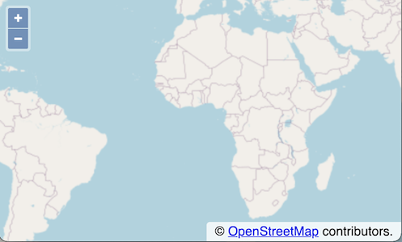

# Creating a Map

In OpenLayers, a map is a collection of layers that get rendered to a web page.  To create a map, you need some markup (HTML) that creates the map viewport (e.g. a `
` element), a bit of style to give the map viewport the appropriate dimensions on your page, and map initialization code.

## Working Example

Make sure you've completed the [setup instructions](../) to install dependencies and get the development server running.

Now let's create a fully working example of an OpenLayers map. At a minimum, we need some markup with a container element for a map, and an OpenLayers `Map` instance which we configure with a layer and a view.

### The Markup

First, we create an `index.html` file in the root of the workshop directory:

[import](../../../src/en/examples/basics/map.html)

Note that we do not need to include any `<script>` for our application. Our Webpack setup takes care of that. Our `<style>` makes the map container fill the whole page, and we will use the container `
` with the `map-container` id as target for the map.

### The Application

To work with OpenLayers, we import the `ol` package from npm. This is done with an `npm install` in our terminal:

    npm install --save ol

Next, as entry point of the application, we create a `main.js` file, and also save it in the root of the workshop directory:

[import](../../../src/en/examples/basics/map.js)

At the top, we import the required modules from the `ol` package. Note the `'ol/ol.css'` import, which adds the styles that OpenLayers requires for its basic UI components. With everything we need imported, we create move on and create a `Map`. The `target` points to the container `
` we have in our markup. We configure the map with a tiled image layer (`TileLayer`) and an `XYZSource`. Finally, the `View` defines the initial `center` and `zoom`.

### Viewing the Map

Now our application is ready for testing. Let's open the working map in a web browser: {{book.workshopUrl}}/. This is how it should look:

In the final chapter of the workshop, we will learn how create a production build of the application for deployment.
