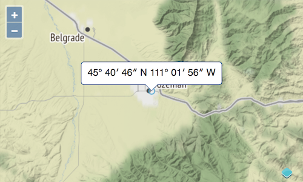

# Showing a Popup on Feature Click

OpenLayers can anchor markup to a position on the map. This can be used to display a popup at a user clicked location. In this case, we just want to show the latitude and longitude of the current user location in a nice little popup.

## CSS and Markup for the Popup

For nice styling of the popup, we can go to http://www.cssarrowplease.com/ and design a container for our popup. I changed the arrow size to 10 and played a bit with the colors. The resulting css is simply copied to the `<style>` section of our index.html:

[import:'css'](../../../src/en/examples/basics/popup.html)

To make the popup look nicer, we give the `.arrow-box` some padding and rounded corners:

[import:'nicer-css'](../../../src/en/examples/basics/popup.html)

In addition to the css, we also need to add the markup for the container the body of our `index.html`:

[import:'markup'](../../../src/en/examples/basics/popup.html)

## Application Code for Interacting with the Map

The `Overlay` module is responsible for anchoring markup to a position on the map, and the `coordinate` module provides a function to format a position in degrees, minutes and seconds. Let's import these two modules:

[import:'import-popup'](../../../src/en/examples/basics/popup.js)

To create the overlay and connect it to the popup, we append the following code to our `main.js`:

[import:'overlay'](../../../src/en/examples/basics/popup.js)

Note the `offset` we configured for the `Overlay`. The y offset (`-10`) has to compensate for the arrow size we provided on http://www.cssarrowplease.com/.

The last step is to append another code snippet to `main.js`, where we listen for user clicks on the map and handle them by showing the popup at the position of the clicked vector feature:

[import:'listen'](../../../src/en/examples/basics/popup.js)

The `on()` function is used to register a listener for clicks, and `Map#getFeaturesAtPixel()` returns the features at the pixel position, where pixels are relative to the map viewport. That `pixel` is provided by the event object (`e`) we get as argument for the listener function.

Now look at the working map in the web browser: {{book.workshopUrl}}/. Once you are zoomed to the current location and see the circle marker, click on it to get the popup. When you click somewhere else on the map, the popup will disappear again.

