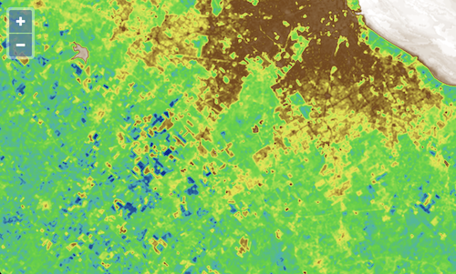

# More colors!

The [`colormap`](https://www.npmjs.com/package/colormap) package is a nice utility library for creating color maps.  This library has already been added as a dependency for the project.  To import it, edit your `main.js` to include the line below:

[import:'import'](../../../src/en/examples/cog/colormap.js)

The `colormap` module exprts a function that returns an array of RGBA color values from one of the named color maps.  As seen in the previous example, we want an array of values that looks like this:

```js
[stopValue0, color0, stopValue1, color1, stopValue1, stopValue2, color2, ...]
```

To create such an array, we'll write a function that takes a `name` for the color map, a `min` stop value, a `max` stop value, a number of `steps`, and an option to `reverse` the array of colors from the `colormap` function.  Add the following function to your `main.js`:

[import:'func'](../../../src/en/examples/cog/colormap.js)

Now we can modify our layer style's `color` expression to use an array of stop and color values.  Edit the layer definition in `main.js` to use our new function:

The layer:
[import:'layer'](../../../src/en/examples/cog/colormap.js)

Reload {{book.workshopUrl}}/ to see your new color map applied to the NDVI output.


