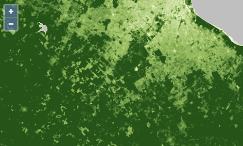

# Band math

We have seen how the `ol/source/GeoTIFF` source can be used to render true and false color composites.  We did this by rendering scaled reflectance values directly into one of the red, green, or blue display channels.  It is also possible to run calculations on reflectance values from a GeoTIFF (or other data tile source) and map the output values to RGBA color values.

The `ol/layer/WebGLTile` layer accepts a `style` property that can be used to control source rendering.  In this example, we'll use math expressions to calculate the Normalized Difference Vegetation Index ([NDVI](https://en.wikipedia.org/wiki/Normalized_difference_vegetation_index)) from the same Sentinel-2 sources used in the previous examples.

The NDVI is the ratio of the difference between near-infrared (NIR) and red to the sum of near-infrared and red reflectance values.

```
NDVI = (NIR - RED) / (NIR + RED)
```

This normalized difference provides an index of green vegetation density or health.  In dividing the difference in NIR and red reflectance by the sum, the index is normalized against variations in brightness or illumination.  The idea is that vegetated sunny slopes should have a similar index as vegetated shady slopes.

To render NDVI values, we need to configure our source to use the near-infrared (B08) and red (B04) bands.  Update your `main.js` script so the source looks like this:

[import:'source'](../../../src/en/examples/cog/ndvi.js)

Next, we'll create the expression for calculating NDVI from the source's input bands.  Add the following variables to your `main.js`:

[import:'expression'](../../../src/en/examples/cog/ndvi.js)

The expressions above use an array-based syntax of this form: `[operator, ...arguments]`.  The `band` operator accesses bands from the list of `sources` for the `ol/source/GeoTIFF` – where the first configured band is 1, the second is 2, etc.  The `-`, `+`, and `/` operators calculate the difference, sum, and ratio of their input arguments.  The `ndvi` expression will result in a value between -1 (not very vegetated) and 1 (very vegetated).  The next step is to map these values to colors.

The `ol/layer/WebGLTile` layer's `style` takes a `color` property that determines the final output color for each pixel.  We want to interpolate colors between the unvegetated (brownish) and vegetated (green) NDVI values.  To do this, we use an `interpolate` operator, applying `linear` interpolation between a number of stop values.

Edit your `main.js` so the layer definition looks like this:

[import:'layer'](../../../src/en/examples/cog/ndvi.js)

If everything worked out, you should see your NDVI visualization at {{book.workshopUrl}}/.



Choosing these stop values and colors is hard work.  Next up we will pull in a helper library to do this for us.
