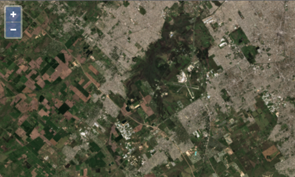

# Simplifying the map's view configuration

In the previous example, we had to configure the map's view with information about the spatial reference system and location of the image.

The first thing we needed to know was an identifier for the spatial reference system. In this case, the GeoTIFF is accompanied by [STAC metadata][stac-metadata] that includes this projection information (see the `proj:epsg` property).

[import:'projection'](../../../src/en/examples/cog/true-color-parts.js)

The second piece of metadata we needed to know was the bounding box or extent of the image. This is also included in the [STAC metadata][stac-metadata] in geographic coordinates (see the `bbox` array). We needed to transform this from geographic coordinates into EPSG:32721 (or WGS 84 / UTM zone 21S). OpenLayers has support for transforming coordinates to and from UTM projections, so we used this to transform the image extent.

[import:'extent'](../../../src/en/examples/cog/true-color-parts.js)

With this information, we were able to configure the view for the map:

[import:'map'](../../../src/en/examples/cog/true-color-parts.js)

GeoTIFF imagery extends regular TIFF imagery with special "geo" tags that provide information about things like the spatial reference system and coordinate location of the imagery.  The `ol/source/GeoTIFF` source in OpenLayers parses this information and can ideally be used to configure a map's view.

The `source.getView()` method of the GeoTIFF source returns a promise for view properties (like `projection`, `center`, `extent`, and `zoom`) that resolves when the GeoTIFF metdata has been parsed.  The map constructor now accepts a `view` option that can be a promise for these same properties.  So instead of digging through the metadata ourselves to find things like `projection` and `extent`, we can provide the map with a promise for view properties from the source.

Update your `main.js` so that the map constructor uses this new method for getting view properties from the source:

[import:'map'](../../../src/en/examples/cog/simplified-view.js)

Now you can remove the `projection`, `extent`, and related imports (`View`, `transformExtent`, and `getCenter`) from your `main.js` file.

You should find the same result as before at {{book.workshopUrl}}/ – only this time we had to write less code!

[stac-metadata]: https://s3.us-west-2.amazonaws.com/sentinel-cogs/sentinel-s2-l2a-cogs/21/H/UB/2021/9/S2B_21HUB_20210915_0_L2A/S2B_21HUB_20210915_0_L2A.json
