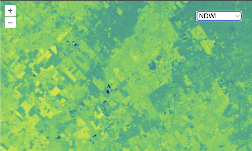

# Visualization chooser

In the previous examples, we have seen a true color composite, a false color composite, and an NDVI rendering of the same Sentinel-2 image.  It would be nice to allow users to choose from one of these visualizations and more without having to change our code each time.  To do this, we'll create a list of available visualizations and add a `<select>` element to our page to let users choose which to display.

In addition to the true color, false color, and NDVI visualizations, we'll add a new Normalized Difference Water Index ([NDWI](https://en.wikipedia.org/wiki/Normalized_difference_water_index)).  This is similar to NDVI except that it can be used to monitor changes in water bodies.

```
NDWI = (GREEN - NIR) / (GREEN + NIR)
```

As we've seen, each visualization needs to have an array of `sources` (these are the URLs for single- or multi-band GeoTIFFs), an optional `max` value for scaling GeoTIFF values, and an optional `style` for rendering the layer.  In addition, we'll give each visualization a `name` for displaying to the user.

Edit your `main.js` to include the visualizations data below:

[import:'visualizations'](../../../src/en/examples/cog/visualizations.js)

Now instead of creating our GeoTIFF source and layer once, we need a function to create these when the user chooses a visualization.  This function will take a `base` URL and a `visualization` and will return a `layer`. Edit your `main.js` to remove the source and layer definitions and include this function instead:

[import:'layer'](../../../src/en/examples/cog/visualizations.js)

Next we can change the map definition in `main.js` so it doesn't include any layers at all (these will be added when the user selects a visualization):

[import:'map'](../../../src/en/examples/cog/visualizations.js)

Now we need a way for users to choose which visualization to show.  For this, we'll add a `<select>` element to the `index.html` just before the `<script>` tag:

[import:'markup'](../../../src/en/examples/cog/visualizations.html)

To get this `<select>` element to display over the map in the top right corner, add the following block to the `<style>` tag in your `index.html`:

[import:'style', lang:'css'](../../../src/en/examples/cog/visualizations.html)

With the `<select>` element in place, we need to populate it with an `<option>` for each of the visualization names.  To do this, add the following to your `main.js` somwhere below the `visualizations` array:

[import:'visualization-selector'](../../../src/en/examples/cog/visualizations.js)

Finally, we will create a function to update the map with a new layer based on the selected visualization.  We'll add this function as a `change` listener on our `<select>` element and call it to initalize our application:

[import:'update'](../../../src/en/examples/cog/visualizations.js)

Now {{book.workshopUrl}}/ should show a visualization chooser.



Nice!  Now the user can choose what type of visualization to render.  But wouldn't it be nice to be able to change the imagery source too?  That's next.
