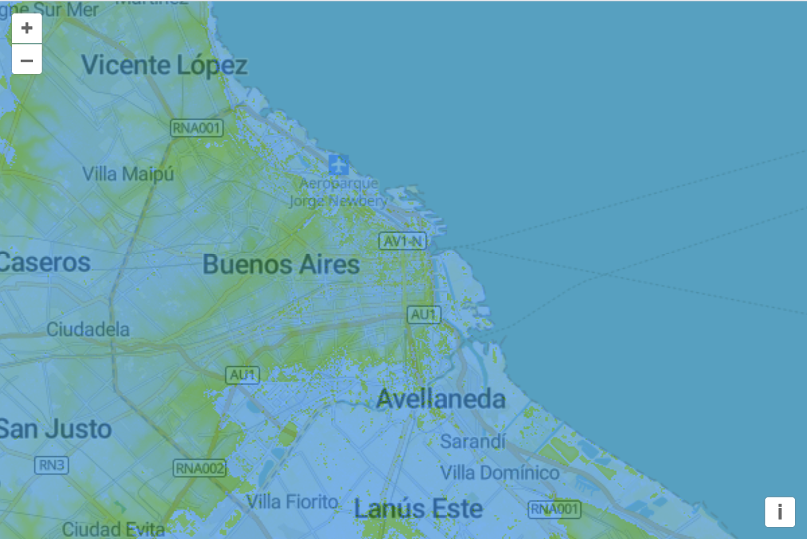

# Render elevation data

MapTiler provides a global tileset with [elevation data](https://cloud.maptiler.com/tiles/terrain-rgb/) encoded as PNG files.

Let's see what these tiles look like by adding them to our map.  In your `main.js`, create a new layer that uses the MapTiler `terrain-rgb` tileset:

[import:'layer'](../../../src/en/examples/data-tiles/elevation.js)

After adding that layer to your map, you should be able to [reload the page]({{book.workshopUrl}}/) some oddly colored tiles shown over your base layer.  The elevation data in the Terrain-RGB tiles is encoded in the red, green, and blue channels.  So while this data isn't meant to be rendered directly, it is interesting to look at.

