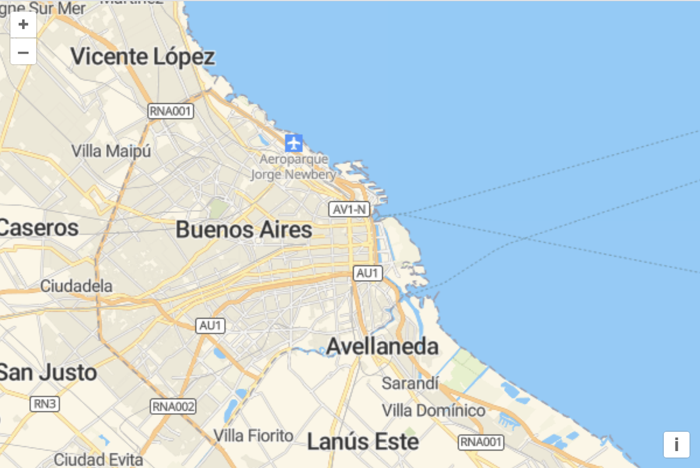

# Map setup

Edit your `index.html` so we're ready to render a full page map:

[import](../../../src/en/examples/data-tiles/map.html)

Clear out your `main.js` and add the following imports:

[import:'import'](../../../src/en/examples/data-tiles/map.js)

In this section, we'll be using tiles from [MapTiler](https://www.maptiler.com/cloud/).  If you don't have an account already, you can sign up for a free one and use your key in these examples.  After signing up for an account, find your [default API key](https://cloud.maptiler.com/account/keys/), and add it to `main.js`:

```js
const key = '<your-default-api-key>';
```

To verify that everything works, we'll create a map with a single layer using your API key.

[import:'map'](../../../src/en/examples/data-tiles/map.js)


