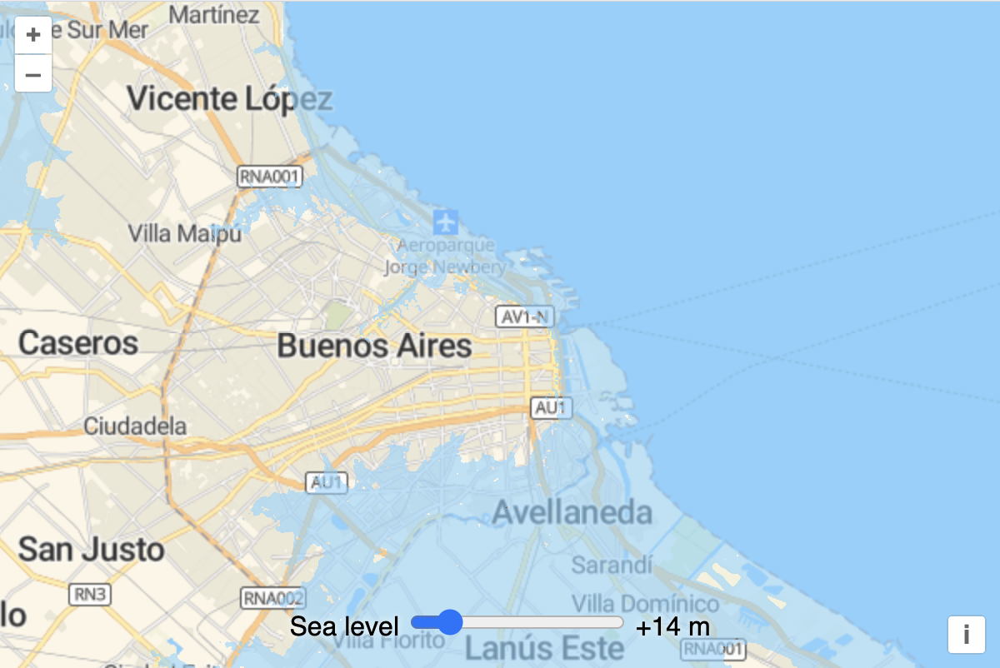

# Render sea level

In the previous step, we rendered the Terrain-RGB tiles directly on the map.  What we want to do is render sea level on the map instead.  And we want users to be able to adjust the height above sea level and see the adjusted height rendered on the map.  We'll use a WebGL tile layer to work with the elevation data directly and get the user input from an input slider on the page.

Let's add the controls to the page first.  In your `index.html`, add the following label and input slider:

[import:'controls'](../../../src/en/examples/data-tiles/sea-level.html)

Now add some style to those controls (in the `<style>` of your `index.html`):

[import:'style', lang:'css'](../../../src/en/examples/data-tiles/sea-level.html)

Instead of directly rendering the R, G, B, A values from the Terrain-RGB tiles, we want to manipulate the pixel values before rendering.  The WebGL tile layer allows you to manipulate pixel values in a `style` expression before rendering them.  This expression is evaluated for every pixel in the input source.

First, import the `WebGLTile` layer (in `main.js`):

[import:'import'](../../../src/en/examples/data-tiles/sea-level.js)

The elevation values in the `terrain-rgb` tiles are encoded as red, gree, and blue values (from 0-255) in the tiles according to the [following formula](https://cloud.maptiler.com/tiles/terrain-rgb/):

```
elevation = -10000 + ((R * 256 * 256 + G * 256 + B) * 0.1)
```

We can use the WebGL style expression language to represent that formula.  Add the expression below to your `main.js`.  This expression decodes the input elevation data — transforming red, green, and blue values into a single elevation measure.

[import:'elevation'](../../../src/en/examples/data-tiles/sea-level.js)

Create a WebGL tile layer that uses the expression above:

[import:'layer'](../../../src/en/examples/data-tiles/sea-level.js)

The `color` expression above uses a `case` expression to color values at or below sea level as blue.  Elevation values above sea level will be transparent (with an alpha value of `0`).

Next we need to listen for changes on the slider input and update the `seaLevel` style variable when the user adjusts the value.

[import:'controls'](../../../src/en/examples/data-tiles/sea-level.js)

With all this in place, [the map]({{book.workshopUrl}}/) should now have a slider that let's users control changes in sea level.


