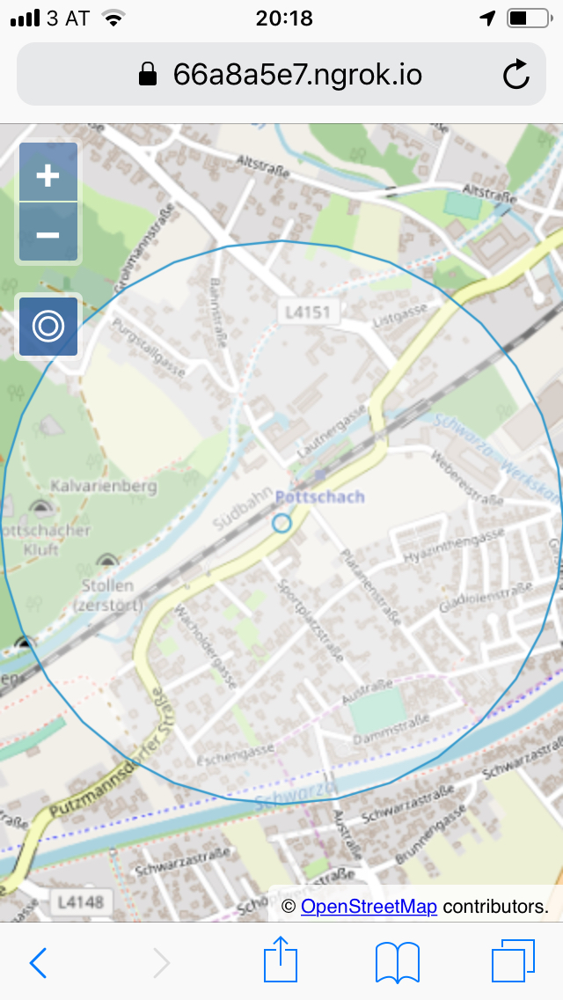

# Show the user's location

On our map, we want to see where we are. The browser's Geolocation API gives us access to the device's GPS position (or an estimated positon on devices without a GPS). In OpenLayers, we can visualize the position with an icon on the map. In addition, we can show the accuracy radius around the reported position. We can also add a button that allows centering the map on the current position.

The first thing to do in `main.js` is add imports for the vector source and layer we're going to use:

[import:'import-layer'](../../../src/en/examples/mobile/geolocation.js)

Next, we can create a vector source for the GPS location we want to show, add the source to a layer, and add the layer to the map:

[import:'layer'](../../../src/en/examples/mobile/geolocation.js)

Now it is time to import the feature and geometry components we need for visualizing the GPS location:

[import:'import-geolocation'](../../../src/en/examples/mobile/geolocation.js)

With that in place, we can finally add a code snippet that gets the location and its accuracy from the browser's Geolocation API:

[import:'geolocation'](../../../src/en/examples/mobile/geolocation.js)

This snippet uses the `watchPosition()` function, which updates the user's location as soon as it changes. It takes the latitude, longitude and accuracy, and creates two features: a circular polygon with the accuracy radius, and a point with the location. Both features are transformed from geographic coordinates into the view projection.

In addition to the above, we also add an error handler which notifies the user when the location is not available, and configures the Geolocation API to enable high accuracy. The latter is important, because it makes the browser ask for the exact GPS position, instead of just an estimated location.

At this point, the map displays the user's location already. What we still have to add is a button that centers the map on that location. The easiest way to get this is to use an OpenLayers `Control`, which we are going to import now:

[import:'import-control'](../../../src/en/examples/mobile/geolocation.js)

Next we'll create the markup for the control and register a click listener. The listener fits the map to the extent of the source that holds the location point and the accuracy polygon, in a 0.5 seconds animation, when the button is clicked:

[import:'control'](../../../src/en/examples/mobile/geolocation.js)

To position the control button under the zoom buttons, we add a few lines of css to the `<style>` section of `index.html`:

[import:'css-control', lang:'css'](../../../src/en/examples/mobile/geolocation.html)

The result after clicking the button should look something like this:

