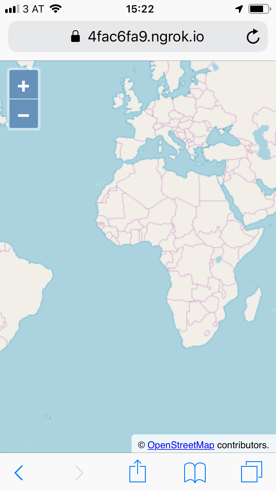

# A mobile map

OpenLayers supports mobile devices out of the box, providing multi-touch gestures like pinch zoom and rotation. So there is nothing OpenLayers specific to do here, only the general rules for mobile web pages apply.

The nice thing about mobile devices is that we have access to sensors like the GPS or a gyroscope, which we will be using here as a compass.

## Markup for a mobile web page

We start with the same markup in `index.html` as we had for the [basic map](../basics/) we already created. The only difference is an additional `meta` tag in the document's `head` to add `device-width` and `initial-scale` settings for the viewport:

[import](../../../src/en/examples/mobile/index.html)

## A street map for navigation

The map we start with in `main.js` is also almost the same as the [basic map](../basics/) from the previous exercise. We only replace the `XYZSource` with a `OSMSource`, which gives us access to [OpenStreetMap](https://openstreetmap.org/)'s default map:

[import](../../../src/en/examples/mobile/map.js)

## Testing on a mobile device

Since a gyroscope is typically not available on desktop computers, we'll need to test our application on a mobile device. For security reasons, access to the Geolocation is only granted to pages served over secure connections.

The easiest way to achieve that is to use https://ngrok.com. Once set up, the application can be served with the following command in a new terminal:

    ./ngrok http 3000 --host-header="localhost:3000"

When everything works, open the `https://` page indicated by ngrok's output on a mobile device:

