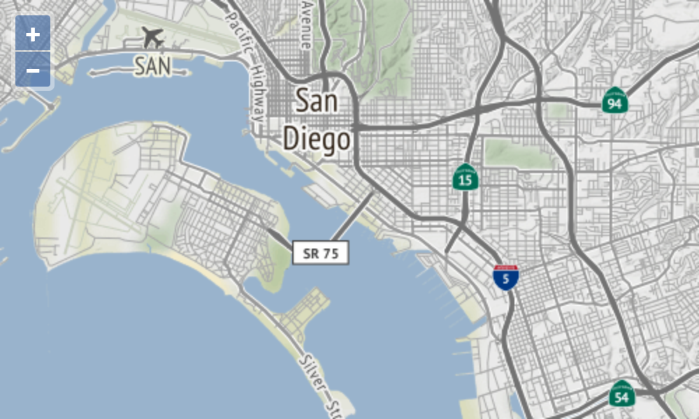

# Map setup

Edit your `index.html` so we're ready to render a full page map:

[import](../../../src/en/examples/raster/map.html)

We'll start out with a map centered on San Diego showing a single XYZ source.  Update your `main.js` so it looks like this:

[import](../../../src/en/examples/raster/map.js)

