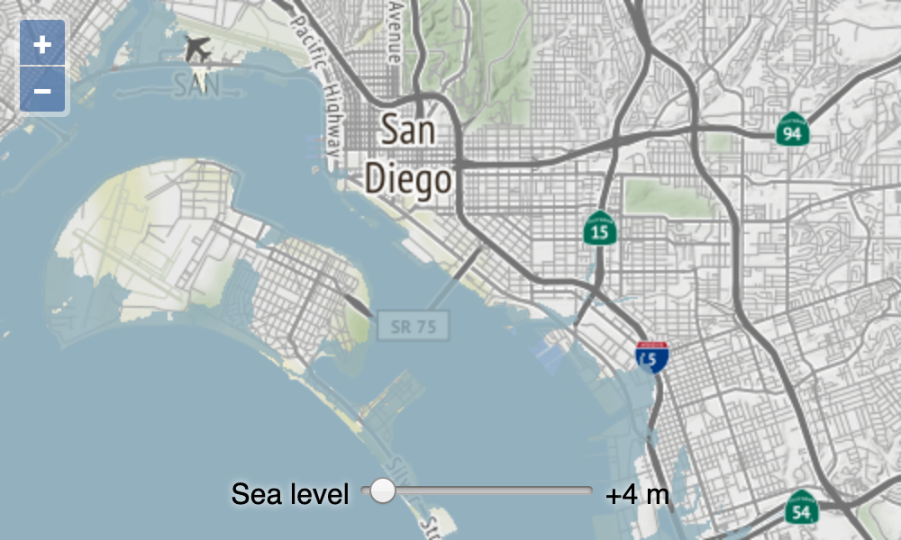

# Render sea level

In the previous step, we rendered the Terrain-RGB tiles directly on the map.  What we want to do is render sea level on the map instead.  And we want users to be able to adjust the height above sea level and see the adjusted height rendered on the map.  We'll use a raster source to work with the elevation data directly and get the user input from an input slider on the page.

Let's add the controls to the page first.  In your `index.html`, add the following label and input slider:

[import:'controls'](../../../src/en/examples/raster/raster.html)

Now add some style to those controls (in the `<style>` of your `index.html`):

[import:'style', lang:'css'](../../../src/en/examples/raster/raster.html)

Instead of directly rendering the R, G, B, A values from the Terrain-RGB tiles, we want to manipulate the pixel values before rendering.  The raster source allows you to do this by accepting any number of input sources and an *operation*.  This operation is a function that gets called for every pixel in the input sources.  We only have one input source (elevation), so it will get called with an array of one pixel, where a pixel is a `[red, green, blue, alpha]` array.  The operation also gets called with a `data` object.  We'll use the `data` object to pass along the value of the input slider.

First, import the `RasterSource` and `ImageLayer` (in `main.js`):

[import:'import'](../../../src/en/examples/raster/raster.js)

Add the function below to your `main.js`.  This function decodes the input elevation data — transforming red, green, and blue values into a single elevation measure.  For elevation values at or below the user selected value, the function returns a partially transparent blue pixel.  For values above the user selected value, the function returns a transparent pixel.

[import:'flood'](../../../src/en/examples/raster/raster.js)

Create a raster source with a single input source (the elevation data), and configure it with the `flood` operation.

[import:'raster'](../../../src/en/examples/raster/raster.js)

Listen for changes on the slider input and re-run the raster operations when the user adjusts the value.

[import:'controls'](../../../src/en/examples/raster/raster.js)

The `beforeoperations` event is fired before the pixel operations are run on the raster source.  This is our opportunity to provide additional data to the operations.  In this case, we want to make the range input value (meters above sea level) available.

[import:'beforeops'](../../../src/en/examples/raster/raster.js)

Finally, render the output from the raster operation by adding the source to an image layer.  Replace the tile layer with an image layer that uses our raster source (modify the `layers` array in `main.js`):

[import:'layer'](../../../src/en/examples/raster/raster.js)

With all this in place, [the map]({{book.workshopUrl}}/) should now have a slider that let's users control changes in sea level.

