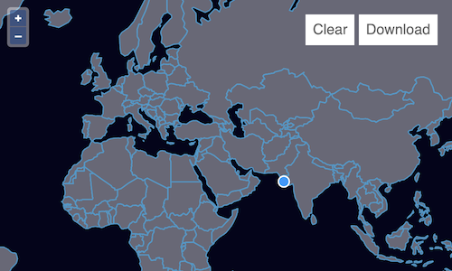

# Downloading features

After uploading data and editing it, we want to let our users download the result.  To do this, we'll serialize our feature data as GeoJSON and create an `<a>` element with a `download` attribute that triggers the browser's file save dialog.  At the same time, we'll add a button to the map that let's users clear existing features and start over.

First, we need a bit of markup to represent the buttons.  Add the following elements after the `map-container` in your `index.html`:

[import:'markup'](../../../src/en/examples/vector/download.html)

Now we need some CSS to make the buttons look right.  Add something like this to the `<style>` element in `index.html`:

[import:'tools', lang:'css'](../../../src/en/examples/vector/download.html)

Clearing features is the easier part, so we'll do that first.  The vector source has a `source.clear()` method.  We want clicks on the "Clear" button to call that method, so we'll add a listener for `click` in our `main.js`:

[import:'clear'](../../../src/en/examples/vector/download.js)

To serialize our feature data for download, we'll use a `GeoJSON` format.  Since we want the "Download" button to work at any time during editing, we'll serialize features on every `change` event from the source and construct a data URI for the anchor element's `href` attribute:

[import:'download'](../../../src/en/examples/vector/download.js)

