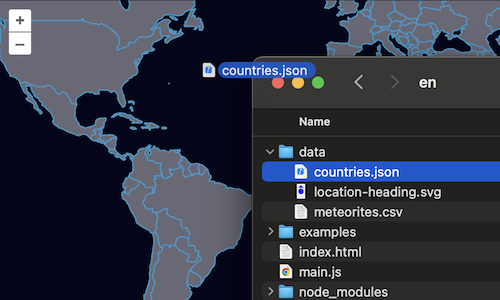

# Drag and drop

For our feature editor, we want users to be able to import their own data for editing.  We'll use the `DragAndDrop` interaction for this.  As before, we'll stick with the GeoJSON format for parsing features, but the interaction can be configured to work with any number of feature formats.

Start by editing the map configuration in your `main.js` file so that there are no layers added. We're going to be passing our map to a number of other components in this exercise, so make sure you have assigned the map to a variable named `map`.:

[import:'map'](../../../src/en/examples/vector/drag-n-drop.js)

Next, import the drag and drop interaction into your `main.js`:

[import:'import'](../../../src/en/examples/vector/drag-n-drop.js)

Next, we'll create a vector source with no initial data.  Instead of loading data from a remote location as in the previous example, this source will store features that the user drags and drops onto the map.

[import:'source'](../../../src/en/examples/vector/drag-n-drop.js)

Now, remove the old `layers` list from the map, create a new layer with our empty vector source, and add it to the map.

[import:'layers'](../../../src/en/examples/vector/drag-n-drop.js)

Finally, we'll create a drag and drop interaction, configure it to work with our vector source, and add it to the map:

[import:'interaction'](../../../src/en/examples/vector/drag-n-drop.js)

Now you should be able to drag and drop GeoJSON files onto [the map]({{book.workshopUrl}}/) and see them rendered.

