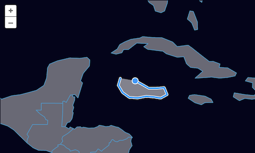

# Drawing new features

Our feature editor can now be used for loading data and modifying features.  Next up, we'll add a `Draw` interaction to allow people to draw new features and add them to our source.

First, import the `Draw` interaction (in `main.js`):

[import:'import-draw'](../../../src/en/examples/vector/draw.js)

Now, create a draw interaction configured to draw polygons and add them to our vector source:

[import:'draw'](../../../src/en/examples/vector/draw.js)

The `type` property of the draw interaction controls what type of geometries are drawn.  The value can be any of the GeoJSON geometry types.  Note that we could have also imported the `GeometryType` enum (`import GeometryType from 'ol/geom/GeometryType';`) and used `GeometryType.POLYGON` instead of the `'Polygon'` string above.

With our draw interaction [in place]({{book.workshopUrl}}/), we can now add new features to our vector source.

