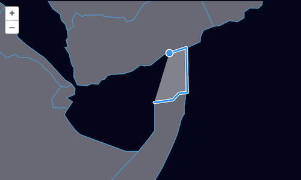

# Snapping

You may have noticed that it is easy to draw features that don't line up nicely with existing features.  In addition, when modifying features, we can break topology — adding a void between polygons that were previously adjacent.  The `Snap` interaction can be used to help preserve topology while drawing and editing features.

First, import the `Snap` interaction into your `main.js`:

[import:'import-snap'](../../../src/en/examples/vector/snap.js)

As with the other editing interactions, we'll configure the snap interaction to work with our vector source and add it to the map:

[import:'snap'](../../../src/en/examples/vector/snap.js)

With the draw, modify, and snap interactions all active, we [can edit]({{book.workshopUrl}}/) data while maintaining topology.

