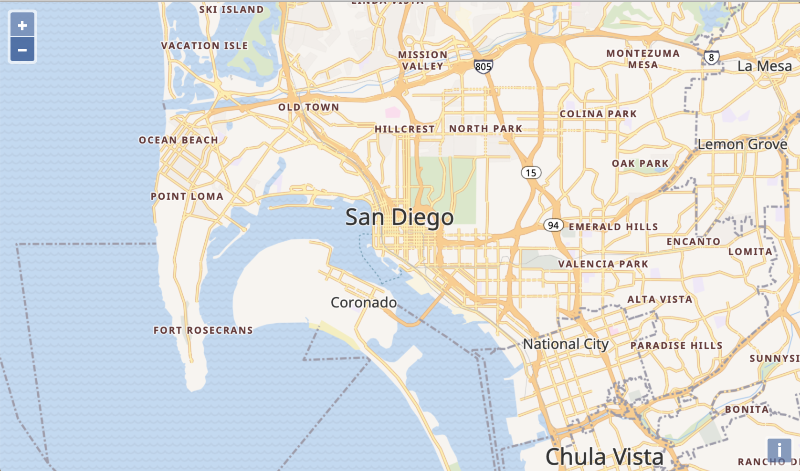

# Making things look bright

Obviously the map we currently have needs some style. And world maps made of vector tiles are actually only useful in combination with a style.

In the history of web mapping, there have been many attempts to create tools and formats for styling maps. The most popular formats were probably SLD and CartoCSS. A graphical tool that comes to mind is Atlas Styler. But none of these format or tools were really convenient to use.

Mapbox finally came up with Mapbox Studio, a very user friendly style editor, and the Mapbox Style format. The Mapbox Style format is easy to read and write manually, and supported by a growing number of applications. A graphical Open Source editor, [Maputnik](https://maputnik.github.io/), is available as an independent alternative to Mapbox Studio for creating and modifying Mapbox Style files.

The Mapbox Style format was not just made for styling vector data. It was made to describe an entire map, with all its sources and layers, and its initial view configuration (e.g. center and zoom level).

The [ol-mapbox-style](https://npmjs.com/package/ol-mapbox-style/) package adds support for the Mapbox Style format to OpenLayers. Once we have taken a look at how that format works, let's see how we can use ol-mapbox-style to give the vector tile data a professionallz authored street map style

## Using a Mapbox Style definition

The tile dataset we use also comes with a style (see https://cloud.maptiler.com/maps/bright/). I have put a copy of this style in the `data/` directory. To make use of that, we bring in the [ol-mapbox-style](https://npmjs.com/package/ol-mapbox/style) utility. This package is already installed as part of the workshop dependendencies.  If it were not already included, you could install it from a terminal with `npm install ol-mapbox-style`.

We'll import the `apply` function from this package, so we can simply have a map with all the contents from a style file rendered into our `map-container`. Usage is really simple. Our whole `main.js` can be reduced to two imports and one line of code:

[import](../../../src/en/examples/vectortile/bright.js)

What a relief. Finally we can enjoy a nice looking world map, and zoom in to San Diego!

