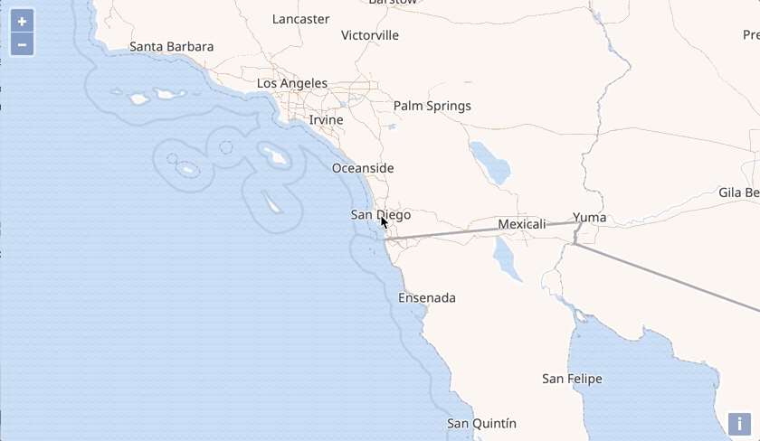

# Interact with VectorTile features

The nice thing about vector tiles is that we can interact with features, because we have the data on the client. One thing to note though is that vector tiles are optimized for rendering. This means that features only contain attributes that are needed for filtering and rendering, and that geometries are optimized for the rendered resolution and clipped near the tile boundary.

For this exercise, we're going to draw a box around the features at the pointer's location when hovering over them.

## Adding a vector layer for exploring the data

We will be highlighting the geometries of the hovered features and show a label with their source layers on a separate vector layer. The following imports are needed, and we add them next to the other imports in `main.js`:

[import:'import-layer'](../../../src/en/examples/vectortile/interact.js)

Next, we can create a source for the layer, the layer, and add it to the map:

[import:'layer'](../../../src/en/examples/vectortile/interact.js)

Here we are using flat styles, which were added to the library not so long ago. As you can see, it is also possible to access feature properties:

[import:'coalesce'](../../../src/en/examples/vectortile/interact.js)

This retrieves the value of the `layers` property, which we will be showing as label. The `coalesce` expression allows to provide a fallback value when the first expression does not return a value. This comes in handy because only the point feature we add in the next step will have a `features` property, but not the features copied over from the `VectorTile` layers.

## Interacting with the map

Now it is time to add a `pointermove` listener to the map, which gets all the features at the pointer location and adds their bounding boxes to the layer. We need two additional imports for that:

[import:'import-interaction'](../../../src/en/examples/vectortile/interact.js)

Finally we can add the code that clears the current contents of the source and adds the features at the pointer location and a feature for a label listing the layers of these features as new content:

[import:'interaction'](../../../src/en/examples/vectortile/interact.js)

Let's dissect this huge code snippet a bit:

[import:'get-features'](../../../src/en/examples/vectortile/interact.js)

This gets the features under the pointer, but excluding the `info` layer, which is the layer we're copying vector tile features from. This is because we do not want to get duplicated results in the next rendering cycle.

[import:'layers-label'](../../../src/en/examples/vectortile/interact.js)

Here we get the source layers from the features we copied over, and create a new feature with a point at the pointer coordinate, and the list of source layers as `layers` property.

`Array.from(new Set(layers))` takes the layers array, which may contain duplicate layer entries, turns it into a `Set`, and converts it back to an array. This is an easy way to remove duplicates from an array in JavaScript.

Now when hovering over the map, the result should look like this:

