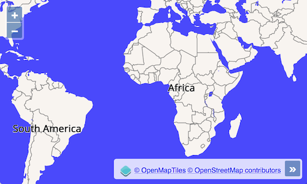

# Styling a VectorTile layer

Styling a vector tile layer works exactly the same way as styling a vector layer. We will now try to style our world map so it actually looks like a world map is supposed to look.

## Load fonts

Let's say we want to use a nicer font for labels in our map. I decided to use the Open Sans font family, which can easily be loaded with an additional stylesheet in the `<head>` of our index.html:

[import:'font'](../../../src/en/examples/vectortile/ugly.html)

## Set a map background

A common style element in vector tile maps is a background color, which the user sees in places that are not covered by any geometries. Like we already saw in the [vector](../vector/download.md) exercise, this can be done by simply setting a background color in a `<style>` for the `#map-container`:

[import:'background'](../../../src/en/examples/vectortile/ugly.html)

## Style the layer with a style function

Now we are going to add some application code to `main.js`.

Style functions are called very often (e.g. whenever the center or resolution of the map changes), so it is a good idea to reuse style objects. We'll need a few of them, e.g. to have point, label, line and polygon styles:

[import:'style-reuse'](../../../src/en/examples/vectortile/ugly.js)

The style function itself is a bit long:

[import:'style'](../../../src/en/examples/vectortile/ugly.js)

Now what's left to do is assign the style function to the layer:

[import:'style-assign'](../../../src/en/examples/vectortile/ugly.js)

I think you will agree that we have not reached our goal of creating a beautiful world map:

There is much more effort involved in styling a world map appropriately, and writing a style function in JavaScript is probably not the right tool. In the [next](bright.md) exercise, we will learn a different way of loading and styling vector tile layers.
