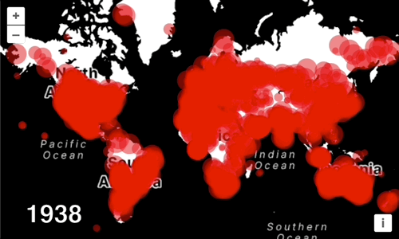
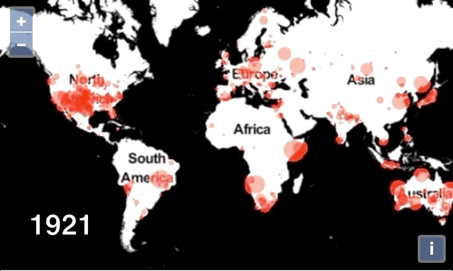

# Animating meteorite impacts

So far we have managed to get data from our CSV file rendered with WebGL, but the map is pretty uninteresting.  We're using the mass of the meteorite to determine the radius of the circle, but we're not making use of the meteorite impact date that we parsed as the `year` property in our point features.

The `year` property for our meteorite features have values that range from 1850 to 2015.  We'll set up an animation loop that increments the current year, render meteorites on their impact year, and then decrease their size as time passes.

As a first step, we'll get the animation loop going and render the current year to a `
` on top of the map.  Add the following markup below the map container in your `index.html`:

[import:'markup'](../../../src/en/examples/webgl/animated.html)

Edit the `<style>` block to include the following rule:

[import:'style', lang:'css'](../../../src/en/examples/webgl/animated.html)

Now we'll declare some variables to represent the time range of the data and the rate at which we want the animation to proceed.  Add the following code above your custom layer class in `main.js`:

[import:'years'](../../../src/en/examples/webgl/animated.js)

Next we need to assign our map instance to a `map` variable that we can reference later:

[import:'declaration'](../../../src/en/examples/webgl/animated.js)

Below the map configuration, add the following `render` function to get the animation loop started.

[import:'animate'](../../../src/en/examples/webgl/animated.js)

If you got it all right, you should see the years rolling by in the lower left corner above the map.

The next part gets a bit tricky to explain.  We want the current year and the impact year for each feature to be available in our fragment shader.  We'll use those two values to decide whether or not to render a feature, and we want to make the circles smaller as time passes beyond the impact year.

The WebGL points renderer provides us with an `opacityCallback` that would typically be used to change the opacity of an image or icon used to symbolize a point.  The function gets called with a feature and is expected to return a number.  We'll (mis)use this callback to pass the impact year for each feature into the shader.  In the shader, the value will be available as `v_opacity`.  This is a bit of a hack, but it will get the job done.  In an upcoming release, we'll make it possible to pass data like this in a more generic way.

Add the following `opacityCallback` to the options passed to the WebGL points layer renderer:

[import:'opacity'](../../../src/en/examples/webgl/animated.js)

The impact year varies with each feature that is rendered.  That value is made available in the shader as a [`varying`](https://thebookofshaders.com/glossary/?search=varying).  The current year, on the other hand, is uniform for all features that we render.  To make that value available in our fragment shader, we'll use a [`uniform`](https://thebookofshaders.com/glossary/?search=uniform).  The options to the WebGL point layer renderer accepts a `uniforms` object where we can supply functions are called to return values for uniforms supplied to the fragment shader.  Add the code below to the options passed to the WebGL point layer renderer:

[import:'uniforms'](../../../src/en/examples/webgl/animated.js)

Finally, we'll update the fragment shader to use the impact year (`varying`) and current year (`uniform`) data that we configured above.  The `main` function of the shader will discard data for which the impact year is greater than the current year.  When the current year is greater than the impact year, we will render circles with decreasing radius.

Update the fragment shader for your WebGL point renderer to match the code below:

[import:'fragment'](../../../src/en/examples/webgl/animated.js)

With that in place, you should now be able to see meteor impact sites appearing and then decreasing in size as time passes.

