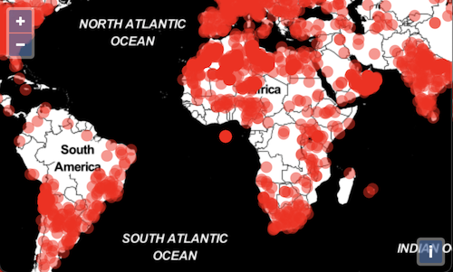

# Rendering points with WebGL

In the previous step, we rendered point features with the normal vector layer.  This layer uses the 2D canvas context for rendering.  With this layer, you can render tens of thousands of points – as long as you are careful about writing efficient styling code.  For rendering larger numbers of points, or to do more efficient dynamic styling, WebGL is a good solution.  OpenLayers has a growing set of utilities for rendering with WebGL.  WebGL rendering is currently limited to points, and that is what we'll do in this exercise.

First, we'll import the constructor for the WebGL point renderer and a math utility function:

[import:'imports'](../../../src/en/examples/webgl/squares.js)

Next, we'll create a custom layer using the WebGL `PointsLayer` renderer.  To create a custom layer, we need to override the `createRenderer` function returning our renderer instance.  We construct this renderer with `colorCallback` and `sizeCallback` functions to determine the color and size of rendererd points.

[import:'points'](../../../src/en/examples/webgl/squares.js)

In the `layers` array for your map, replace the `VectorLayer` with an instance of your `CustomLayer` using the same vector source as before.

[import:'layer'](../../../src/en/examples/webgl/squares.js)

Tada!  Meteorite impact locations rendered with WebGL.

Unfortunately, we'd rather see these as circles instead of squares, so we'll need to do some work (this may change before the final 6.0 release).

To get our points rendered as circles, we need to create a custom fragment shader.  We'll pass the shader to the WebGL points layer renderer as a string `fragmentShader` property of the second argument to the renderer constructor.  The fragment shader is written in OpenGL Shading Language (GLSL).  If you're interested in learning more about shaders and WebGL, take a look at [The Book of Shaders](https://thebookofshaders.com/).

Add the `fragmentShader` below to the options passed to the point renderer (along with `colorCallback` and `sizeCallback`).

[import:'fragment'](../../../src/en/examples/webgl/circles.js)

Looking better!  The shader above uses the [`smoothstep` function](https://thebookofshaders.com/glossary/?search=smoothstep) to turn what was a square into a circle.  Fiddle with the values passed to `smoothstep` to see if you can get a feel for how it works.

