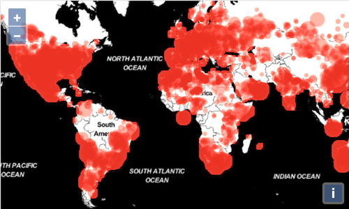
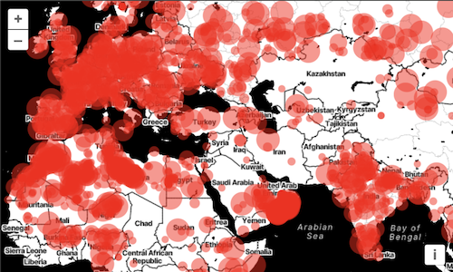

# Rendering points with WebGL

In the previous step, we rendered point features with the normal vector layer.  This layer uses the 2D canvas context for rendering.  With that layer, you can render tens of thousands of points – as long as you are careful about writing efficient styling code.  For rendering larger numbers of points, or to do more efficient dynamic styling, WebGL is a good solution.  OpenLayers has a growing set of utilities for rendering with WebGL.  In this exercise we'll use it to render point geometries.

First, we'll import the constructor of the WebGL-enabled points layer. This layer is an easy-to-use entry point for leveraging the advantages of the WebGL technology.

[import:'import'](../../../src/en/examples/webgl/circles.js)

This is a replacement for the `VectorLayer` import, which you can now remove.

Replace the `const meteorites...` assignment with an instance of your `WebGLVectorLayer` using the same vector source as before.

[import:'layer'](../../../src/en/examples/webgl/circles.js)

Tada! Meteorite impact locations rendered with WebGL.

Like in the previous version, we specified a `style` parameter when creating the layer, and that style allowed us to specify the appearance of the points (red, semi-transparent circles).

This concept of 'flat styles' is available for both Canvas 2D and WebGL layers, although the supported range of features differs a bit.

> WebGL layers use a completely different rendering system, and the style object is actually transformed dynamically into fragment and vertex shaders. 

By navigating the map you might notice a performance improvement from the previous step where we were using a standard Canvas 2D layer. This would be more pronounced if we had hundreds of thousands of points to render.

Now, I think we can all agree on the fact that this map isn't great to look at: that is probably because *each and every point* has the same styling.

Let's begin by sizing our circles depending on the mass of the meteorite. To achieve this, we're replacing the `circle-radius` of the style with the following expression:

[import:'size'](../../../src/en/examples/webgl/dynamic.js)

This expression results in a minimum radius of 4 pixels, which can grow by 9 pixels depending on the mass of the meteorite,  

The `WebGLVectorLayer` class supports this kind of expression for the numerical attributes of its style (size, opacity, color components, etc.).

An expression is composed of **operators** that are expressed as *arrays* like so:

[import:'operator1'](../../../src/en/examples/webgl/dynamic.js)
[import:'operator2'](../../../src/en/examples/webgl/dynamic.js)
[import:'operator3'](../../../src/en/examples/webgl/dynamic.js)
[import:'operator4'](../../../src/en/examples/webgl/dynamic.js)

The first operator, `get`, will read the feature's attribute by its name. The other operators, here showcased `clamp`, `*` and `+`, allow manipulating the output of another operator. In the previous example we used these to transform the meteorites mass values into a final size comprised between 8 and 26.

Looking better and better!

