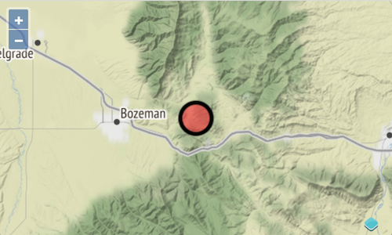

# Dessiner un point à votre position

Maintenant que nous avons une carte centrée sur notre position, nous voulons également montrer la position exacte en faisant un rendu du point à cet endroit.

## Ajouter une couche vecteur

En plus d'afficher des cartes à partir de tuiles fournies par un service de tuiles, OpenLayers peut faire le rendu de données vecteur. Une couche vecteur a une source qui contient des objets géographiques. Dans cet exemple simple, nous ajoutons seulement un objet géographique unique avec une géométrie de type point qui représente notre position.

Quelques imports supplémentaires sont requis:

[import:'import-vector'](../../../src/en/examples/basics/point-feature.js)

La couche vecteur elle-même est créée avec le code suivant, que nous mettons entre les blocs `const map` et` navigator.geolocation` dans notre fichier `main.js`:

[import:'point-layer'](../../../src/en/examples/basics/point-feature.js)

Nous pouvons maintenant créer une objet ponctuel et l'ajouter à la couche vecteur dès que nous connaissons notre position. Ceci est fait avec une seule ligne à la fin du callback de la fonction `getCurrentPosition` de l'objet `geolocation`:

[import:'add-point'](../../../src/en/examples/basics/point-feature.js)

## Styler le point

Pour rendre le point de notre position plus facile à voir sur la carte, nous pouvons donner à la couche vecteur un peu de style. Cela nécessite l'ajout de plus d'imports au sommet de notre `main.js`.

[import:'import-style'](../../../src/en/examples/basics/point-feature.js)

Le code pour ajouter le style peut être ajouté après la définition `VectorLayer`:

[import:'style'](../../../src/en/examples/basics/point-feature.js)

Une fois terminé, le résultat devrait ressembler à ceci:

