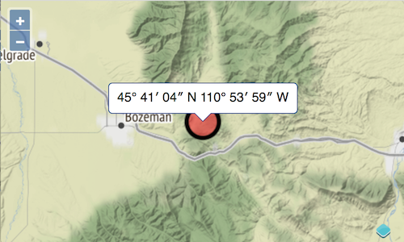

# Montrer une popup au clic d'un objet géographique

OpenLayers peut ancrer le markup à un position sur la carte. Cela peut être utilisé pour afficher une popup à l'emplacement cliqué par un utilisateur. Dans ce cas, nous voulons simplement montrer la latitude et la longitude de l'emplacement actuel de l'utilisateur dans une petite popup sympathique.

## CSS et markup pour la popup

Pour un style agréable de la popup, nous pouvons aller à http://www.cssarrowplease.com/ et designer un container pour notre popup. J'ai changé la taille de la flèche à 10 et j'ai joué un peu avec les couleurs. Le css résultant est simplement copié dans la section `<style>` de notre index.html:

[import:'css'](../../../src/en/examples/basics/popup.html)

Pour que le popup soit plus agréable, nous donnons à `.arrow-box 'un peu de padding et des coins arrondis:

[import:'nicer-css'](../../../src/en/examples/basics/popup.html)

En plus du css, nous devons également ajouter le markup pour le container dans le corps de notre `index.html`:

[import:'markup'](../../../src/en/examples/basics/popup.html)

## Code de l'application pour interagir avec la carte

Le module `Overlay` est responsable de l'ancrage du markup à une position sur la carte, et le module` coordinate 'fournit une fonction pour formater une position en degrés, minutes et secondes. Importons ces deux modules:

[import:'import-popup'](../../../src/en/examples/basics/popup.js)

Pour créer notre "superposition" et la connecter à la popup, nous ajoutons le code suivant à notre `main.js`:

[import:'overlay'](../../../src/en/examples/basics/popup.js)

Notez le `offset 'que nous avons configuré pour` `Overlay`. Le offset y (`-10`) doit compenser la taille de la flèche que nous avons fournie avec http://www.cssarrowplease.com/.

La dernière étape est d'ajouter un autre snippet de code à `main.js`, où nous avons un "listener" pour les clics de l'utilisateur sur la carte et le gérons en montrant la popup à l'emplacement le l'objet géographique cliqué:

[import:'listen'](../../../src/en/examples/basics/popup.js)

La fonction `on()` est utilisé pour enregistrer un "listener" pour les clicks, et `Map#getFeaturesAtPixel()` retourne les objets géographiques à l'emplacement du pixel, où les pixels sont relatifs à la fenêtre de carte. Ce `pixel` est fournit par l'objet d'événement (`e`) que nous avons comme argument pour la fonction de "listener".

Maintenant, regardez la carte en fonctionnement dans le navigateur web: {{book.workshopUrl}}/. Une fois que vous avez zoomé à l'emplacement actuel et que vous voyez le marqueur circulaire, cliquez dessus pour avoir la popup. Lorsque vous cliquez à un autre endroit sur la carte, la popup disparaîtra à nouveau.

