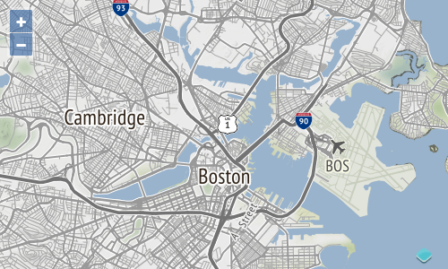

# Configuration de la carte

Modifiez votre `index.html` afin que nous soyons prêts à faire le rendu d'une carte pleine page:

[import](../../../src/en/examples/raster/map.html)

Nous commencerons par une carte centrée sur Boston montrant une seule source XYZ. Mettez à jour votre `main.js` afin qu'il ressemble à ceci:

[import](../../../src/en/examples/raster/map.js)

