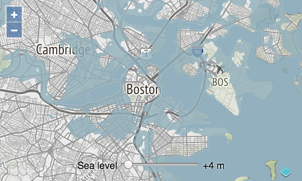

# Faire le rendu du niveau de la mer

Dans l'étape précédente, nous avons rendu les tuiles Terrain-RGB directement sur la carte. Ce que nous voulons faire est de rendre le niveau de la mer sur la carte à la place. Et nous voulons que les utilisateurs puissent régler la hauteur au-dessus du niveau de la mer et voir la hauteur ajustée rendue sur la carte. Nous allons utiliser une source raster pour travailler directement avec les données d'élévation et obtenir l'entrée de l'utilisateur à partir d'un slider sur la page.

Ajoutons d'abord les contrôles à la page. Dans votre `index.html`, ajoutez l'étiquette suivante et le slider:

[import:'controls'](../../../src/en/examples/raster/raster.html)

Ajoutez maintenant un style à ces contrôles (dans le `<style>` de votre `index.html`):

[import:'style', lang:'css'](../../../src/en/examples/raster/raster.html)

Au lieu de rendre directement les valeurs R, G, B, A des tuiles Terrain-RGB, nous voulons manipuler les valeurs des pixels avant le rendu. La source raster vous permet de faire ceci en acceptant un nombre quelconque de sources en entrée et une *opération*. Cette opération est une fonction appelée pour chaque pixel dans les sources en entrée. Nous avons seulement une source en entrée (élévation), de sorte qu'il sera appelé avec un tableau d'un pixel, où un pixel est un tableau `[red, green, blue, alpha]`. L'opération est également appelée avec un objet `data`. Nous utiliserons l'objet `data` pour transmettre la valeur du slider en entrée.

Ajoutez la fonction ci-dessous à votre `main.js`. Cette fonction décode les données d'élévation en entrée — transformant les valeurs rouge, vert et bleu en une seule mesure d'élévation. Pour les valeurs d'élévation à ou en dessous de la valeur choisie par l'utilisateur, la fonction renvoie un pixel bleu partiellement transparent. Pour les valeurs au-dessus de la valeur sélectionnée par l'utilisateur, la fonction renvoie un pixel transparent.

[import:'flood'](../../../src/en/examples/raster/raster.js)

Créez une source raster avec une seule source en entrée (les données d'élévation) et configurez-la avec l'opération `flood`.

[import:'raster'](../../../src/en/examples/raster/raster.js)

Écoutez les changements sur l'entrée du slider et relancez les opérations raster lorsque l'utilisateur ajuste la valeur.

[import:'controls'](../../../src/en/examples/raster/raster.js)

L'événement `beforeoperations` est déclenché avant que les opérations de pixel ne soient exécutées sur la source raster. C'est notre opportunité de fournir des données supplémentaires aux opérations. Dans ce cas, nous voulons que la plage de valeurs en entrée (en mètres au-dessus du niveau de la mer) soit disponible.

[import:'beforeops'](../../../src/en/examples/raster/raster.js)

Enfin, faire le rendu depuis l'opération raster en ajoutant la source à une couche image. Remplacez la couche tuilée par une couche image qui utilise notre source raster (modifiez le tableau `layers` dans` main.js`):

[import:'layer'](../../../src/en/examples/raster/raster.js)

Avec tout cela en place, [la carte]({{book.workshopUrl}}/) doit maintenant avoir un slider qui permet aux utilisateurs de contrôler les changements du niveau de la mer.

