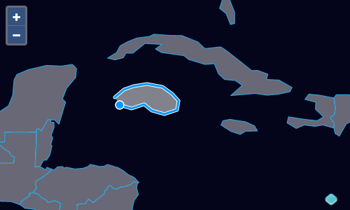

# Dessiner de nouveaux objets géographiques

Notre éditeur d'objets géographiques peut maintenant être utilisé pour charger des données et modifier des objets géographiques. Ensuite, nous ajouterons une interaction `Draw` pour permettre aux gens de dessiner de nouveaux objets géographiques et de les ajouter à notre source.

Tout d'abord, importez l'interaction `Draw` (dans` main.js`):

[import:'import-draw'](../../../src/en/examples/vector/draw.js)

Maintenant, créez une interaction de dessin configurée pour créer des polygones et les ajouter à notre source vecteur:

[import:'draw'](../../../src/en/examples/vector/draw.js)

La propriété `type` de l'interaction de dessin contrôle le type de géométrie dessiné. La valeur peut être n'importe quel type de géométrie GeoJSON. Notez que nous aurions pu également importer l'enum `GeometryType` (avec `import GeometryType from 'ol/geom/geometrytype';`) et utiliser `GeometryType.POLYGON` au lieu de la chaîne `'Polygon'` ci-dessus.

Avec notre interaction `draw` [en place]({{book.workshopUrl}}/), Nous pouvons maintenant ajouter de nouveaux objets géographiques à notre source vecteur.

