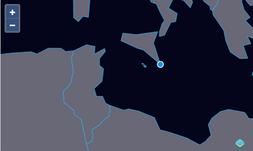

# Modifier les objets géographiques

Maintenant que nous avons un moyen pour les utilisateurs de charger des données dans l'éditeur, nous voulons leur permettre d'éditer des objets géographiques. Nous utiliserons l'interaction `Modify` pour cela, en la configurant pour modifier les objets géographiques de notre source vecteur.

Tout d'abord, importez l'interaction `Modify` dans votre` main.js`:

[import:'import-modify'](../../../src/en/examples/vector/modify.js)

Ensuite, créez une nouvelle interaction connectée à la source vecteur et ajoutez-la à la carte (au bas de `main.js`):

[import:'modify'](../../../src/en/examples/vector/modify.js)

Après avoir ajouté des données à [la carte]({{book.workshopUrl}}/), confirmez que vous pouvez modifier les objets géographiques en faisant glisser leurs sommets. Vous pouvez également supprimer des sommets avec `Alt+Click`.

After adding data to [the map]({{book.workshopUrl}}/) confirm that you can modify features by dragging their vertices.  You can also delete vertices with `Alt+Click`.

