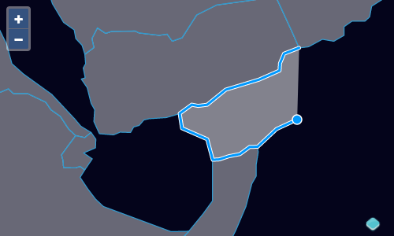

# Magnétisme ou snapping

Vous avez peut-être remarqué qu'il est facile de dessiner des objets géographiques qui ne s'alignent pas bien aux objets géographiques existants. De plus, lors de la modification des objets géographiques, nous pouvons casser la topologie — en ajoutant un vide entre les polygones précédemment adjacents. L'interaction `Snap` peut être utilisée pour aider à préserver la topologie tout en dessinant et en éditant des objets géographiques.

Tout d'abord, importez l'interaction `Snap` dans votre` main.js`:

[import:'import-snap'](../../../src/en/examples/vector/snap.js)

Comme pour les autres interactions d'édition, nous allons configurer l'interaction de snapping pour travailler avec notre source vecteur et l'ajouter à la carte:

[import:'snap'](../../../src/en/examples/vector/snap.js)

Avec les interactions de dessin, de snapping toutes actives, nous [pouvons éditer]({{book.workshopUrl}}/) des données tout en maintenant la topologie.

