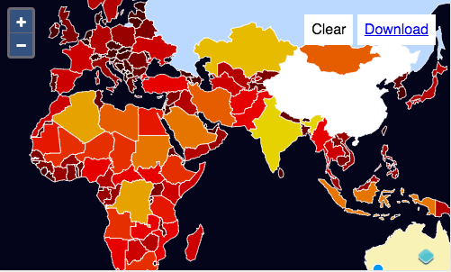

# Rendre l'éditeur plus joli

À ce stade, nous avons un éditeur d'objets géographiques avec des fonctionnalités d'importation, d'édition et d'exportation basiques. Mais nous n'avons pas passé de temps à essayer de rendre les objets géographiques plus jolis. Lorsque vous créez une couche vecteur dans OpenLayers, vous avez un ensemble de styles par défaut. Les interactions d'édition (dessin et modification) viennent également avec leurs propres styles par défaut. Vous avez peut-être remarqué que les géométries avaient une épaisseur plus importante lors de l'édition. Ce comportement peut être contrôlé en fournissant une option `style` à votre couche vecteur et aux interactions d'édition.

## Style statique

Si nous voulions donner à tous nos objets géographiques le même style, nous pourrions configurer notre couche vecteur comme ceci:

```js
const layer = new VectorLayer({
  source: source,
  style: new Style({
    fill: new Fill({
      color: 'red'
    }),
    stroke: new Stroke({
      color: 'white'
    })
  })
});
```

Il est également possible de définir la propriété `style` dans un tableau JavaScript de styles. Cela permet le rendu d'une ligne "emboitée" (une épaisseur large en dessous et une plus étroite au dessus), par exemple.

Bien qu'il n'y ait pas vraiment une bonne justification ici, pour le besoin de cet exercice, nous allons tirer parti du stylage *dynamique*.

## Style dynamique

Lorsque vous voulez prendre des décisions sur la manière dont chaque objet géographique devrait être rendu basé sur quelque chose de l'objet géographique ou de la résolution de la vue actuelle, vous pouvez configurer une couche vecteur avec une fonction de style. Cette fonction est appelée pour chaque objet géographique à chaque frame de rendu, il est donc important d'écrire une fonction efficace si vous disposez de nombreux objets géographiques et souhaitez maintenir une bonne performance de rendu.

Voici un exemple qui rend les objets géographiques en utilisant l'un des deux styles selon si l'attribut "name" commence par "A-M" ou "N-Z" (un exemple complètement artificiel).

```js
const layer = new VectorLayer({
  source: source,
  style: function(feature, resolution) {
    const name = feature.get('name').toUpperCase();
    return name < "N" ? style1 : style2; // assuming these are created elsewhere
  }
});
```

## Style basé sur la surface de la géométrie

Pour voir comment fonctionne le stylage dynamique, nous allons créer une fonction de style qui rend les objets géographiques basées sur la zsurface de la géométrie. Pour ce faire, nous allons utiliser [le package `colormap`](https://www.npmjs.com/package/colormap) sur npm. Nous pouvons ajouter ceci à nos dépendances comme ceci:

    npm install colormap

Maintenant, nous devons importer les constructeurs de style, le package `colormap` et `ol/sphere` pour les calculs de surface sphériques.

[import:'imports'](../../../src/en/examples/vector/style.js)

Ensuite, nous écrirons quelques fonctions pour déterminer une couleur en fonction de la surface d'une géométrie:

[import:'color'](../../../src/en/examples/vector/style.js)

Et maintenant, nous pouvons ajouter une fonction qui crée un style avec une couleur de remplissage basée sur la surface géométrique. Définissez cette fonction comme propriété `style` de votre couche vecteur:

[import:'style'](../../../src/en/examples/vector/style.js)


