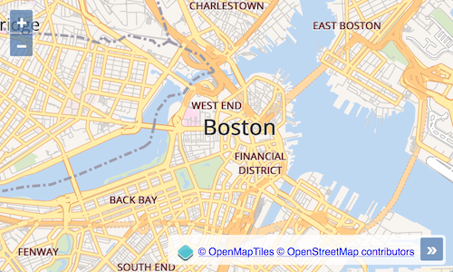

# Rendre les choses "brillantes"

Il y a eu de nombreuses tentatives pour créer des outils et des formats pour styler des cartes. Les formats les plus populaires étaient probablement SLD et CartoCSS. Un outil graphique qui vient à l'esprit est Atlas Styler. Mais aucun de ces formats ni outils n'était vraiment pratique à utiliser.

Mapbox a finalement créé Mapbox Studio, un éditeur de style très convivial et le format Mapbox Style. Le format Mapbox Style est pris en charge par un nombre croissant d'applications et un éditeur Open Source graphique, [Maputnik](https://maputnik.github.io/), est disponible pour créer et modifier des fichiers Mapbox Styles.

Le package [ol-mapbox-style](https://npmjs.com/package/ol-mapbox-style/) ajoute le support pour le format Mapbox Style à OpenLayers. Voyons si nous pouvons obtenir une carte plus agréable que celle de l'exercice [précédent](ugly.md).

## Créer des fichiers Mapbox Style dans Maputnik

Vous pouvez jouer avec une instance en direct de Maputnik à https://maputnik.github.io/editor/, ou le télécharger et l'installer localement. J'ai créé un fichier avec notre style moche. Vous pouvez télécharger ce fichier, [ugly.json]({{book.workshopUrl}}/data/ugly.json) et l'ouvrir dans Maputnik pour vérifier qu'il est tout aussi laid que dans notre application OpenLayers:


## Créez une carte à partir d'un Mapbox Style dans OpenLayers

Nous importerons la fonction `apply` du package [ol-mapbox-style](https://npmjs.com/package/ol-mapbox-style/), afin que nous puissions simplement avoir une carte avec tous les contenus  depuis un fichier de style rendu dans notre `map-container`. Mais d'abord, nous devons installer le package:

    npm install --save ol-mapbox-style

Maintenant, nous pouvons importer la fonction dans notre `main.js`:

[import:'mapbox-style-import'](../../../src/en/examples/vectortile/bright.js)

Nous pouvons également supprimer tous les autres imports, à l'exception de ces deux là:

[import:'imports'](../../../src/en/examples/vectortile/bright.js)

Bien que nous soyons en train de nettoyer, nous pouvons également supprimer les définitions `key`,` map` et `layer`. Et nous pouvons – bien sûr – supprimer tout le code de style. Enfin, dans `index.html`, nous pouvons supprimer la ligne qui ajoute la police Open Sans et la `background-color` pour la carte.

Au lieu du code de carte précédent, nous avons besoin d'une seule ligne pour créer une carte à partir de notre style Mapbox moche, que nous insérons en dessous de nos imports:

```js
const map = apply('map-container', './data/ugly.json');
```

Cela devrait nous donner la même carte laide que précédemment, juste avec moins de code d'application. Mais bon, nous voulions rendre les choses "brillantes" (en référence à "bright"), et ne pas regarder à nouveau une carte moche. Alors, ouvrons 'OSM Bright' à partir des styles de la galerie  de styles de Maputnik, et utilisons cela. Je l'ai déjà préparé et j'ai rendu disponible le résultat dans {{book.workshopUrl}}/data/bright.json. Nous allons donc modifier la ligne `apply()` à

[import:'map'](../../../src/en/examples/vectortile/bright.js)

Quel soulagement. Enfin, nous pouvons profiter d'une belle carte du monde et zoomer sur Boston!



Et notez que notre carte est toujours interactive, ce qui signifie que vous obtenez une popup d'informations lorsque vous cliquez sur n'importe quelle géométrie.
