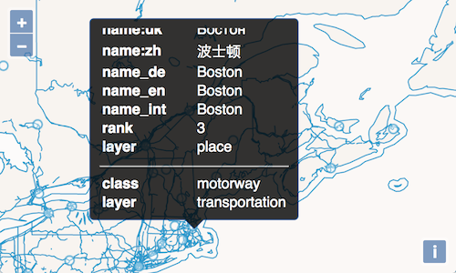

# Interagir avec les objets géographiques de VectorTile

Si nous voulons styler la couche que nous venons de créer, il serait bon d'obtenir des informations sur chaque géométrie que nous voyons sur la carte. La chose sympathique à propos des couches de tuiles vecteur est que nous pouvons interagir avec elles tout comme les couches vecteur. Il est donc facile d'ajouter un "listener" pour les clics sur la carte, d'interroger les objets géographiques à la position cliquée et d'afficher une popup avec les attributs de chaque objet géographique.

## Ajouter une popup

Comme dans l'exercice [les bases](../basics/popup.md), Nous créons une popup en allant sur https://cssarrowplease.com/. Cette fois, j'ai décidé de créer un popup plus sombre. Nous ajoutons le css à la section `<style>` de notre `index.html`:

[import:'popup-css'](../../../src/en/examples/vectortile/interact.html)

Nous allons rendre les tables HTML scrollables dans notre popup, alors notre markup pour la popup nécessite également un `
` pour le contenu de la popup:

[import:'popup-markup'](../../../src/en/examples/vectortile/interact.html)

Pour styler les tables, nous ajoutons un peu plus de styles à la section `<style>` de `index.html`:

[import:'table-css'](../../../src/en/examples/vectortile/interact.html)

Dans le `main.js` de l'application, importer la classe `Overlay`:

[import:'popup-import'](../../../src/en/examples/vectortile/interact.js)

A nouveau dans le `main.js` de l'application, nous pouvons maintenant ajouter le code pour l'`Overlay` de la popup:

[import:'popup'](../../../src/en/examples/vectortile/interact.js)

Pour rendre plus facile la fermeture de la popup afin de ne pas couvrir d'autres objets géographiques que nous pourrions vouloir cliquer, nous ajoutons un "listener" à "l'overlay", de sorte qu'il se ferme quand on clique dessus:

[import:'popup-close'](../../../src/en/examples/vectortile/interact.js)

Appeler `setPosition ()` sur un "overlay" définit une position à `undefined`, ce qui fait disparaître "l'overlay".

## Remplir la popup avec les attributs des objets géographiques

Il est maintenant temps de connecter la popup à un listener `click` sur la carte. Nous ajoutons plus de code au bas de `main.js`:

[import:'interact'](../../../src/en/examples/vectortile/interact.js)

En itérant à travers tout les objets géographiques que nous obtenons à la position cliquée (`map.forEachFeatureAtPixel`), nous construisons une table séparée pour chaque objet géographique. Avec chaque objet géographique, nous itérons via ses propriétés (`feature.getProperties()`) et ajoutons une ligne de table (`<tr>`) pour chaque propriété. Nous avons également configuré une `hitTolerance` de `1` pixel pour faciliter le clic sur les lignes.

## Utiliser l'interactivité pour créer un style pour notre carte

Maintenant, nous pouvons cliquer sur n'importe quelle géométrie dans la carte et utiliser les informations que nous obtenons dans la popup pour créer des styles dans l'exercice [suivant](ugly.ms). Notez que les objets géographiques des tuiles vecteur ont une propriété spéciale `layer`, qui indique la couche source (c'est-à-dire la couche à laquelle appartient l'objet géographique dans la structure de la tuile vecteur, qui est une hiérarchie couche -> objet géographique).

