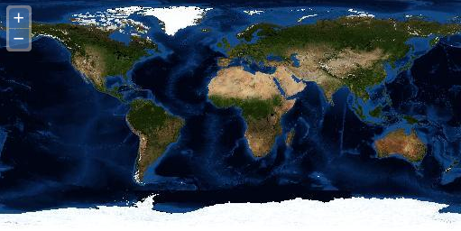

.. _openlayers.basics.map:

Creating a Map
==============

In OpenLayers, a map is a collection of layers and various controls for dealing with user interaction. A map is generated with three basic ingredients: :ref:`markup <openlayers.basics.dissect.markup>`, :ref:`style declarations <openlayers.basics.dissect.style>`, and :ref:`initialization code <openlayers.basics.dissect.code>`.

.. _openlayers.basics.map.example:

Working Example
---------------

Let's take a look at a fully working example of an ol3 map.

.. code-block:: html

    <!doctype html>
    <html lang="en">
      <head>
        <link rel="stylesheet" href="ol3/ol.css" type="text/css">
        
        
        <title>OpenLayers 3 example</title>
      </head>
      <body>
        <h1>My Map</h1>
        

        
      </body>
    </html>

.. rubric:: Tasks

#.  Copy the text above into a new file called :file:`map.html`, and save it in the root of the workshop folder.

#.  Open the working map in your web browser: @workshop_url@/map.html

   
    A working map of displaying imagery of the world.

Having successfully created our first map, we'll continue by looking more closely at :ref:`the parts <openlayers.basics.dissect>`.
