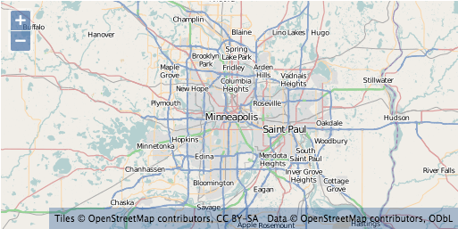

.. _openlayers.layers.cached:

Cached Tiles
============

By default, the WMS layer makes requests for 256 x 256 (pixel) images to fill your map viewport and beyond. As you pan and zoom around your map, more requests for images go out to fill the areas you haven't yet visited. While your browser will cache some requested images, a lot of processing work is typically required for the server to dynamically render images.

Since tiled layers (such as the WMS layer) make requests for images on a regular grid, it is possible for the server to cache these image requests and return the cached result next time you (or someone else) visits the same area - resulting in better performance all around.


.. _openlayers.layers.cached.xyz:

OpenLayers.Layer.XYZ
--------------------

The Web Map Service specification allows a lot of flexibility in terms of what a client can request. Without constraints, this makes caching difficult or impossible in practice.

At the opposite extreme, a service might offer tiles only at a fixed set of zoom levels and only for a regular grid. These can be generalized as XYZ layers - you can consider X and Y to indicate the column and row of the grid and Z to represent the zoom level.


.. _openlayers.layers.cached.osm:

OpenLayers.Layer.OSM
--------------------

The `OpenStreetMap (OSM) <http://www.openstreetmap.org/>`_ project is an effort to collect and make freely available map data for the world. OSM provides a few different renderings of their data as cached tile sets. These renderings conform to the basic :ref:`XYZ grid <openlayers.layers.cached.xyz>` arrangement and can be used in an OpenLayers map. The ``OpenLayers.Layer.OSM`` constructor accesses OpenStreetMap tiles.

.. _openlayers.layers.cached.example:

.. rubric:: Tasks

#.  Open the ``map.html`` file from the :ref:`previous section <openlayers.layers.wms>` in a text editor and change the map initialization code to look like the following:
    
    .. code-block:: html

        <script>
            var center = new OpenLayers.LonLat(-93.27, 44.98).transform(
                'EPSG:4326', 'EPSG:3857'
            );

            var map = new OpenLayers.Map("map-id", {projection: 'EPSG:3857'});

            var osm = new OpenLayers.Layer.OSM();
            map.addLayer(osm);

            map.setCenter(center, 9);
        </script>

#.  In the ``<head>`` of the same document, add a few style declarations for the layer attribution.
    
    .. code-block:: html
    
        <style>
            #map-id {
                width: 512px;
                height: 256px;
            }
            .olControlAttribution {
                font-size: 10px;
                bottom: 5px;
                left: 5px;
            }
        </style>

#.  Save your changes, and refresh the page in your browser: @workshop_url@/map.html


   
    A map with an OpenStreetMap layer.


A Closer Look
~~~~~~~~~~~~~

Projections
```````````
Review the first 3 lines of the initialization script:

.. code-block:: javascript

    var center = new OpenLayers.LonLat(-93.27, 44.98).transform(
        'EPSG:4326', 'EPSG:3857'
    );

Geospatial data can come in any number of coordinate reference systems. One data set might use geographic coordinates (longitude and latitude) in degrees, and another might have coordinates in a local projection with units in meters. A full discussion of coordinate reference systems is beyond the scope of this module, but it is important to understand the basic concept.

OpenLayers needs to know the coordinate system for your data. Internally, this
is represented with an ``OpenLayers.Projection`` object. The ``transform`` function also takes strings that represent the coordinate reference system (``"EPSG:4326"`` and ``"EPSG:3857"`` above).

Locations Transformed
`````````````````````

The OpenStreetMap tiles that we will be using are in a Mercator projection. Because of this, we need to set the initial center using Mercator coordinates. Since it is relatively easy to find out the coordinates for a place of interest in geographic coordinates, we use the ``transform`` method to turn geographic coordinates (``"EPSG:4326"``) into Mercator coordinates (``"EPSG:3857"``).

Custom Map Options
``````````````````

.. code-block:: javascript

    var map = new OpenLayers.Map("map-id", {projection: 'EPSG:3857'});

In the :ref:`previous example <openlayers.layers.wms.example>` we used the default options for our map. In this example, we set a custom map projection.

.. note::

    The projections we used here are the only projections that OpenLayers knows
    about. For other projections, the map options need to contain two more
    properties: ``maxExtent`` and ``units``. This information can be looked up
    at http://spatialreference.org/, using the EPSG code.

Layer Creation and Map Location
```````````````````````````````

.. code-block:: javascript

    var osm = new OpenLayers.Layer.OSM();
    map.addLayer(osm);

As before, we create a layer and add it to our map. This time, we accept all the default options for the layer.

.. code-block:: javascript

    map.setCenter(center, 9);
    
Finally, we give our map a center (in Mercator coordinates) and set the zoom level to ``9``.

Style
`````

.. code-block:: html

    .olControlAttribution {
        font-size: 10px;
        bottom: 5px;
        left: 5px;
    }

A treatment of map controls is also outside the scope of this module, but these style declarations give you a sneak preview. By default, an ``OpenLayers.Control.Attribution`` control is added to all maps. This lets layers display attribution information in the map viewport. The declarations above alter the style of this attribution for our map (notice the small Copyright line at the bottom left of the map).

Having mastered layers with publicly available cached tile sets, let's move on to working with :ref:`proprietary layers <openlayers.layers.proprietary>`.

