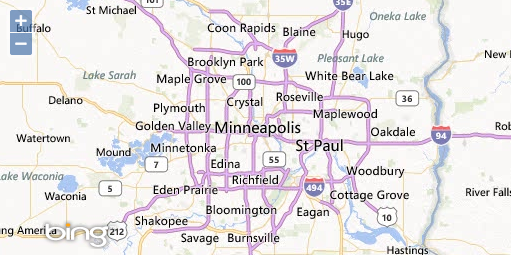

.. _openlayers.layers.proprietary:

Proprietary Layers
==================

In previous sections, we displayed layers based on a standards compliant :abbr:`WMS (OGC Web Map Service)` and a custom tile cache. Online mapping (or at least the tiled map client) was largely popularized by the availability of proprietary map tile services. OpenLayers provides layer types that work with these proprietary services through their APIs.

In this section, we'll build on the example developed in the :ref:`previous section <openlayers.layers.cached.example>` by adding a layer using tiles from Bing.
.. _openlayers.layer.proprietary.bing:

Bing!
-----

Let's add a Bing layer.

.. rubric:: Tasks

#.  In your ``map.html`` file, find where the :abbr:`OSM (OpenStreetMap)` source is configured and change it into an ```ol.source.BingMaps```

    .. code-block:: javascript

        source: new ol.source.BingMaps({
          style: 'Road',
          key: 'Ak-dzM4wZjSqTlzveKz5u0d4IQ4bRzVI309GxmkgSVr1ewS6iPSrOvOKhA-CJlm3'
        })

    .. note:: The Bing tiles API requires that you register for an API key to use with your mapping application.  The example here uses an API key that you should not use in production.  To use the Bing layer in production, register for an API key at https://www.bingmapsportal.com/.
    
#.  Save your changes and reload ``map.html`` in your browser: @workshop_url@/map.html
    

   
    A map with a tile with a Bing Maps source.

Complete Working Example
````````````````````````

Your revised ``map.html`` file should look something like this:

.. code-block:: html

  <!doctype html>
  <html lang="en">
    <head>
      <link rel="stylesheet" href="ol3/ol.css" type="text/css">
      <style>
        .map {
          height: 256px;
          width: 512px;
        }
        .ol-attribution ul, .ol-attribution a {
          color: black;
        }
      </style>
      <script src="http://ol3js.org/en/master/build/ol-simple.js" type="text/javascript"></script>
      <title>OpenLayers 3 example</title>
    </head>
    <body>
      <h1>My Map</h1>
      <div id="map" class="map"></div>
      <script type="text/javascript">
        var map = new ol.Map({
          target: 'map',
          renderer: ol.RendererHint.CANVAS,
          layers: [
            new ol.layer.Tile({
              source: new ol.source.BingMaps({
                style: 'Road',
                key: 'Ak-dzM4wZjSqTlzveKz5u0d4IQ4bRzVI309GxmkgSVr1ewS6iPSrOvOKhA-CJlm3'
              })
            })
          ],
          view: new ol.View2D({
            center: ol.proj.transform([-93.27, 44.98], 'EPSG:4326', 'EPSG:3857'),
            zoom: 9
          })
        });
      </script>
    </body>
  </html>

Next we'll move on from raster layers and begin working with :ref:`vector layers
<openlayers.layers.vector>`.
