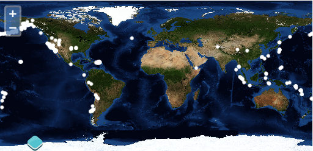

.. _openlayers.layers.vector:

Vector Layers
=============

Previous sections in this module have covered the basics of raster layers with OpenLayers. This section deals with vector layers - where the data is rendered for viewing in your browser.

OpenLayers provides facilities to read existing vector data from the server,  make modifications to feature geometries, and  determine how features should be styled in the map.

Though browsers are steadily improving in terms of JavaScript execution speed (which helps in parsing data), there are still serious rendering bottlenecks which limit the quantity of data you'll want to use in practice. The best advice is to try your application in all the browsers you plan to support, to limit the data rendered client side until performance is acceptable, and to consider strategies for effectively conveying information without swamping your browser with too many vector features (the technical vector rendering limits of your browser often match the very real limitations of your users to absorb information).

Rendering Features Client-Side
------------------------------

Let's go back to the :ref:`WMS example <openlayers.layers.wms.example>` to get a basic world map.  We'll add some feature data on top of this in a vector layer.

.. rubric:: Tasks

#.  Open ``map.html`` in your text editor and copy in the contents of the initial :ref:`WMS example <openlayers.layers.wms.example>`. Save your changes and confirm that things look good in your browser: @workshop_url@/map.html


#.  In your map initialization code (anywhere after the ``map`` construction), paste the following. This adds a new vector layer to your map that requests a set of features stored in GeoRSS:
    
    .. code-block:: javascript
    
        var earthquakes = new OpenLayers.Layer.Vector("Earthquakes", {
            strategies: [new OpenLayers.Strategy.Fixed()],
            protocol: new OpenLayers.Protocol.HTTP({
                url: "data/layers/7day-M2.5.xml",
                format: new OpenLayers.Format.GeoRSS()
            })
        });
        map.addLayer(earthquakes);

        

   
    World map with orange circles representing earthquake locations.
    
A Closer Look
`````````````

Let's examine that vector layer creation to get an idea of what is going on.

.. code-block:: javascript

    var earthquakes = new OpenLayers.Layer.Vector("Earthquakes", {
        strategies: [new OpenLayers.Strategy.Fixed()],
        protocol: new OpenLayers.Protocol.HTTP({
            url: "data/layers/7day-M2.5.xml",
            format: new OpenLayers.Format.GeoRSS()
        })
    });

The layer is given the title ``"Earthquakes"`` and some custom options. In the options object, we've included a list of ``strategies`` and a ``protocol``. A full discussion of strategies and protocols is beyond the scope of this module, but here is a rough sketch of what they do:

* Strategies determine when your data is requested and how to handle that data once it has been turned into features. Strategies can also be used to trigger an update of your data when something has been modified. Strategies are ordered and independent--they can work with the results of a previous strategy, but they can't rely on other strategies being there.

* Protocols refer to communication protocols between client and server for reading and writing feature data. Protocols may have a format (parser) that is responsible for serializing and deserializing feature data.

In this case, we're using a fixed strategy. The fixed strategy triggers a single request for data and doesn't ever ask for updates. We're asking for data using the HTTP protocol, we provide the URL for the data, and we expect the features to be serialized as GeoRSS.

.. rubric:: Bonus Tasks

#.  The orange circles on the map represent ``OpenLayers.Feature.Vector`` objects on your ``OpenLayers.Layer.Vector`` layer. Each of these features has attribute data with ``title``, ``description``, and ``link`` properties. Add an ``OpenLayers.Control.SelectFeature`` control to your map, listen for the ``featureselected`` event on the vector layer, and display earthquake information below the map viewport.

#.  Continuing on with the above task, use one of the ``OpenLayers.Popup``  classes to display feature information in a popup on the map.  The popup should open on feature selection and close when a feature is unselected.

#.  The data for the vector layer comes from an earthquake feed published by the USGS (http://earthquake.usgs.gov/earthquakes/catalogs/).  See if you can find additional data with spatial information in GeoRSS or another OpenLayers supported format.  If you save another feed (or other document) representing spatial data in your ``data`` directory, you should be able to view it in a vector layer on your map.
