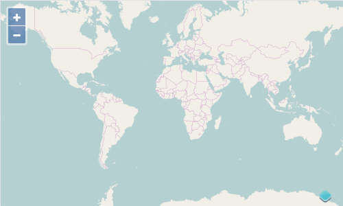

# Creating a Map

In OpenLayers, a map is a collection of layers that get rendered to a web page.  To create a map, you need some markup (HTML) that creates the map viewport (e.g. a `
` element), a bit of style to give the map viewport the appropriate dimensions on your page, and map initialization code.

## Working Example

Let's take a look at a fully working example of an OpenLayers map.

First, the markup (`index.html`) with `<style>` to make the map container fill the whole page:

[import](../examples/basics/index.html)

Next, the application entry point (`main.js`) that initializes the map:

[import](../examples/basics/step-1.js)

### Tasks

1.  Make sure you've completed the [setup instructions](../) to install dependencies and get the development server running.

1.  Copy the HTML above into a new file called `index.html`, and save it in the root of the workshop directory.

1.  Copy the JavaScript above into a new file called `main.js`, and save it in the root of the workshop directory.

1.  Open the working map in your web browser: {{ book.workshopUrl }}/

