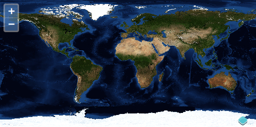

# Criando um mapa

No OpenLayers, uma mapa é uma coleção de camadas e várias interações e controles para interagir com o usuário. Um mapa é gerado a partir de três ingredientes básicos: marcação, declarações de estilo e código de inicialização.

## Exemplo completo

Vejamos um exemplo completo de um mapa OpenLayers.

```html
<!doctype html>
<html lang="en">
  <head>
    <link rel="stylesheet" href="/ol.css" type="text/css">
    <style>
      #map {
        height: 256px;
        width: 512px;
      }
    </style>
    <title>OpenLayers example</title>
    <script src="/loader.js" type="text/javascript"></script>
  </head>
  <body>
    <h1>My Map</h1>
    <div id="map"></div>
    <script type="text/javascript">
      var map = new ol.Map({
        target: 'map',
        layers: [
          new ol.layer.Tile({
            title: 'Global Imagery',
            source: new ol.source.TileWMS({
              url: 'https://ahocevar.com/geoserver/wms',
              params: {LAYERS: 'nasa:bluemarble', TILED: true}
            })
          })
        ],
        view: new ol.View({
          projection: 'EPSG:4326',
          center: [0, 0],
          zoom: 0,
          maxResolution: 0.703125
        })
      });
    </script>
  </body>
</html>
```

### Tarefas

1.  Certifique-se de ter completado a [preparação do ambiente](../) para instalar as dependências e ter o servidor de depuração rodando. 

1.  Copie o texto acima em um arquivo chamado `map.html` e salve-o no diretório raiz do workshop.

1.  Abra o arquivo em seu navegador: {{ book.workshopUrl }}/map.html



Tendo criado nosso primeiro mapa com sucesso, examinaremos o exemplo de forma mais [detalhada](./dissect.md).
